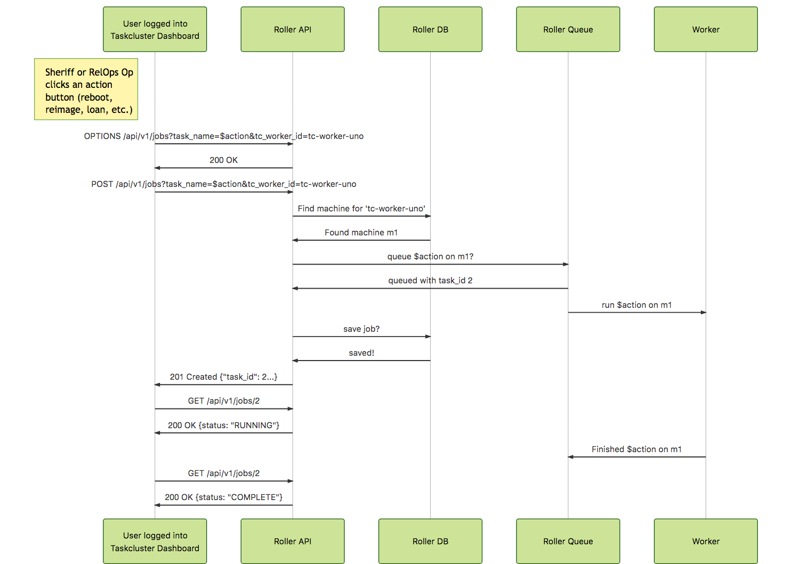

## relops-hardware-controller aka Release Operations Controller or "roller"

A service for managing Fx release operations hardware and rewrite of
[the build-slaveapi](https://github.com/mozilla/build-slaveapi) to
help migrate from [buildbot](http://buildbot.net/) to
[taskcluster](https://github.com/taskcluster).

### Architecture

```
                 +-----------------------------------------------------------------------------+
                 | VPN                                                                         |
                 |                                                                             |
+------------+   |   +--------------+     +----------------+     +-----------+     +--------+  |
|            |   |   |              |     |                |     |           +----->        |  |
|  TC Dash.  +------->      API     +----->     Queue      +----->  Workers  |     |  HW 1  |  |
|            |   |   |              |     |                |     |           <-----+        |  |
|            <-------+              <-----+                <-----+           |     +--------+  |
|            |   |   |              |     |                |     |           |                 |
+------------+   |   +----+---+-----+     +----------------+     |           |     +--------+  |
                 |        |   |                                  |           +----->        |  |
                 |     +--+---+---+                              |           |     |  HW 2  |  |
                 |     |          |                              |           <-----+        |  |
                 |     |    DB    |                              |           |     +--------+  |
                 |     |          |                              |           |                 |
                 |     |          |                              |           |     +--------+  |
                 |     |          |                              |           +----->        |  |
                 |     +----------+                              |           |     |  HW 3  |  |
                 |                                               |           <-----+        |  |
                 |                                               +-----------+     +--------+  |
                 |                                                                             |
                 |                                                                             |
                 +-----------------------------------------------------------------------------+
```

### Data flow



### API (TODO: add schemas)

#### POST /api/v1/jobs\?tc_worker_id\=tc-worker-1\&task_name\=ping

Requires query params `tc_worker_id` and `task_name`.

Param `task_name` must be in `settings.py`.
Param `tc_worker_id` must be in the data and have an associated machine.

Note: these are params and not in the body to support TC actions

Example response:

```json
{"task_name":"ping","tc_worker_id":"tc-worker-1","task_id":"e62c4d06-8101-4074-b3c2-c639005a4430"}
```

The task_id is the Celery Task ID.


### Development

#### Build and run the web and worker containers

1. `make start-web start-worker` Note: the first time the web worker starts up the DB connection will likely fail so run it again (refs: #5)

#### Adding a public HW management task

##### Add it

1. Create `relops_hardware_controller/api/management/commands/<command_name>.py` and `tests/test_<command_name>_command.py` e.g. [ping.py](https://github.com/mozilla-services/relops-hardware-controller/blob/3c1826174fca5face67cebd44e84c40602543a07/relops_hardware_controller/api/management/commands/ping.py) and [test_ping_command.py](https://github.com/mozilla-services/relops-hardware-controller/blob/3c1826174fca5face67cebd44e84c40602543a07/tests/test_ping_command.py)
1. Run `make shell` then `./manage.py` and check for the command in the api section of the output
1. Develop the command as a management command and from the test file.

##### Publish it

1. In `relops_hardware_controller/settings.py` add the command name to `TASK_NAMES` to make it API accessible
1. Add a method called `get_args_and_kwargs_from_job` to the command that takes args self, tc_worker_json, machine_json and returns a tuple of (array of args, dict of kwargs) to call the command with NB: these will be parsed.
1. If necessary, change the `TaskClusterWorker` or `Machine` models or their serializers and run `./manage.py makemigrations`
1. If necessary, add secrets like ssh keys to the celery worker config or container (TODO: add example)

##### Test it

###### from the docker image

1. After running `make clean build`, try running it from docker e.g. with `docker-compose run web python manage.py ping 127.0.0.1`

###### from the API

1. Run a command like `curl -v -w '\n' -X POST -H 'Accept: application/json' -H 'Content-Type: application/json' http://localhost:8000/api/v1/jobs\?tc_worker_id\=tc-worker-1\&task_name\=ping` and check that the worker runs it.


##### TODO: permissions, deployment, register with TC

1. define permissions for it
1. deploy a worker using it and restart the API
1. register the action with taskcluster


#### TODO: Adding a machine or VM

1. open the django admin
1. add a machine (ip, hostname)
1. add it to appropriate groups (xen, hp) or toggle appropriate properties?

#### TODO: Rotating hardware ssh keys
